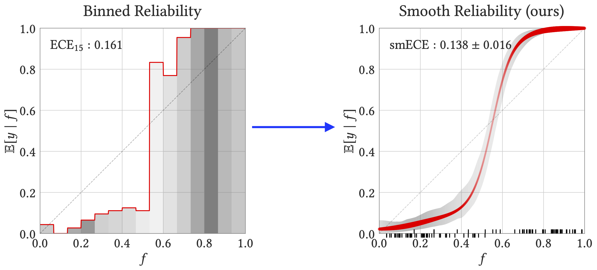
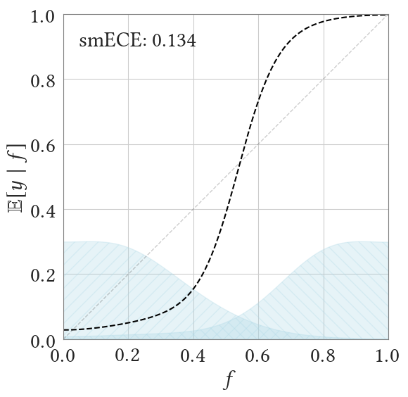

# relplot: Principled Reliability Diagrams

`relplot` is a Python package for plotting reliability diagrams and measuring calibration error,
in a theoretically-principled way.
The package generates reliability diagrams as shown on the right:


***How to Read the Diagram***

* The input data is a set of observations:
pairs of predicted probability and true outcomes $(f_i, y_i) \in [0, 1] \times \{0, 1\}$.
For example, $f_i$ may be the forecasted "chance of rain" on day $i$, and
$y_i$ the indicator of whether it rained or not on day $i$.

* The x-axis shows the predicted probabilities,
and the y-axis shows an estimate of the true probability,
conditioned on the predicted probability. Formally, this is a regression
of outcomes $y$ on predictions $f$.

* The tick marks show the raw data:
namely, the predicted probabilities for up to 100 datapoints,
plotted above or below the x-axis according to whether the true outcome was 1 or 0.
The thickness of the red regression curve represents the smoothed density of these tick marks, while the height of the curve represents the smoothed fraction whose true outcome is 1.

* The SmoothECE (smECE) is a measure of mis-calibration:
it is essentially the average absolute difference
between the red regression curve
and the diagonal, averaged over x-coordinates
that are distributed as the tick marks are
(i.e. integrated over the density of predictions).
See the [paper](https://arxiv.org/abs/2309.12236) for
full details of the estimator and its properties.

* The smECE is reported with $\pm$ denoting 95% confidence intervals, estimated
via bootstrapping. The gray band similarly shows 95% bootstrapped confidence bands around the regression line.

Formally, the reliability diagram is obtained by kernel smoothing with a careful choice of parameters. The choice of smoothing bandwidth (akin to "bin width")
is cruicial, but is done *automatically* by the code in a theorhetically-justified way.

This package is based on the theoretical results in
the paper
[Smooth ECE: Principled Reliability Diagrams via Kernel Smoothing](https://arxiv.org/abs/2309.12236) (ICLR 2024).


## Installation

Install with Pip:
```sh
> pip install relplot
```

Or, clone the repo and install with:
```sh
> cd relplot
> pip install .
```

## Getting Started 

Basic usage:

```python
import relplot as rp

# ...
# f: array of probabilities [f_i]
# y: array of binary labels [y_i]

calib_error = rp.smECE(f, y)   # compute calibration error (scalar)
fig, ax = rp.rel_diagram(f, y) # plot
```
See a quick demo in [notebooks/demo.ipynb](notebooks/demo.ipynb).

For more control, one can compute the calibration data with `relplot.prepare_rel_diagram`, and then plot it later with `relplot.plot_rel_diagram`.
For example:
```python
...
diagram = rp.prepare_rel_diagram(f, y) # compute calibration data (dictionary)
print('calibration error:', diagram['ce']) 
plt.plot(diagram['mesh'], diagram['mu']) # plot the calibration curve manually
fig, ax = rp.plot_rel_diagram(diagram) # plot the diagram in a new figure
```
The smoothed regression function itself is returned as `diagram['mu']`,
which specifies values on the grid of x-coordinates in `diagram['mesh']`.
This can be used for manual re-calibration.

### Manual Bandwidth
To measure SmoothECE with a manual choice of bandwidth
(rather than automatic choice), use:  
```python
calib_error = relplot.smECE_sigma(f, y, sigma=0.05)
```
Using a manual bandwidth can sometimes be desirable for interpretability: `smECE_sigma` behaves similarly to binnedECE with `bin_width=sigma`, at the cost of slightly weaker theoretical guarantees.

### Data Format
Methods expect inputs in the form
of a 1D array of predicted probabilities (f) and a 1D array of binary labels (y),
where $f_i \in [0, 1]$ and $y_i \in \{0, 1\}$.
We then consider the calibration of the
distribution $(f_i, y_i)$ of prediction-outcome pairs.
This package primarily considers the binary outcome setting, but can be used
to measure multi-class confidence calibration as shown below.

### Multi-class Confidence Calibration
In the multi-class setting, *confidence calibration* can be measured by expressing it as the binary
calibration of the distribution on (confidence, accuracy) pairs.
A convenience function for this common use case is provided:
```python
# f: [N, C] array of logits over C classes
# y: [N, 1] array of predicted classes 
conf, acc = relplot.multiclass_logits_to_confidences(f, y) # reduce to binary setting
relplot.rel_diagram(f=conf, y=acc) # plot confidence calibration diagram
relplot.smECE(f=conf, y=acc) # compute smECE of confidence calibration
```

### Customization and Usage Tips
The plot made by `relplot.rel_diagram` can be customized in various ways, as shown below.
See this notebook for examples of more options: [notebooks/figure1.ipynb](./notebooks/figure1.ipynb)


* For small datasets, you may want to disable bootstrapping (which subsamples the data). Pass the parameter `plot_confidence_band=False`.
* To override the automatic choice of kernel bandwidth for the diagram, set the parameter `kde_bandwidth`.




## Additional Notebooks and Features
- The header image (Figure 1 of the paper) is generated in [notebooks/figure1.ipynb](./notebooks/figure1.ipynb)
- The experiments in the paper are reproduced in [notebooks/paper_experiments.ipynb](./notebooks/paper_experiments.ipynb)
- `relplot.metrics` contains implementations of various alternate calibration measures, including binnedECE and laplace kernel calibration. This is in addition to the recommended calibration measure of smoothECE (`relplot.smECE`).
- `relplot.rel_diagram_binned` plots the "binned" reliability diagram. Not recommended for usage; included for comparison.
- `relplot.config.use_tex_fonts` can be set to True if you have $\LaTeX$ installed.


## Citation
If you use relplot in your work, please consider citing:


```bibtex
@inproceedings{blasiok2024smooth,
      title={Smooth {ECE}: Principled Reliability Diagrams via Kernel Smoothing},
      author={B{\l}asiok, Jaros{\l}aw and Nakkiran, Preetum},
      booktitle={The Twelfth International Conference on Learning Representations},
      year={2024},
      url={https://openreview.net/forum?id=XwiA1nDahv}
}
```

### Acknowledgements
We thank Jason Eisner and Adam Goliński for helpful suggestions on the package and documentation.
