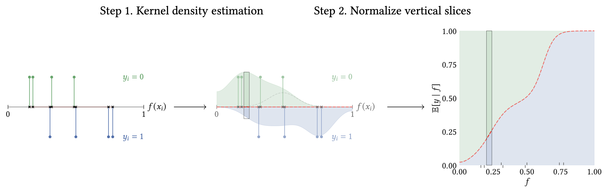

# relplot: Principled Reliability Diagrams

`relplot` is a Python package for plotting reliability diagrams and measuring calibration error,
in a theoretically-principled way.
The package generates reliability diagrams as shown on the right
(reproduced in [notebooks/figure1.ipynb](./notebooks/figure1.ipynb)):


The density of predictions $f_i \in [0, 1]$ is visualized as the
thickness of the red regression line, and the gray band shows
bootstrapped confidence bands around the regression.

The reliability diagram is obtained by kernel smoothing with a careful choice of parameters, and the associated calibration measure is called the *SmoothECE* (abbreviated smECE).
The SmoothECE is roughly equal to the standard ECE of the smoothed reliability diagram.
The reliability diagram for a toy dataset of 8 points is shown below;
more theoretical details are available in the accompanying preprint
[Smooth ECE: Principled Reliability Diagrams via Kernel Smoothing](https://arxiv.org/abs/2309.12236).




## Installation

Install with Pip:
```sh
> pip install relplot
```

Or, clone the repo and install with:
```sh
> cd relplot
> pip install .
```

## Getting Started 

Basic usage (on sample data):

```python
import relplot as rp
import numpy as np

## generate toy data (miscalibrated)
N = 5000
f = np.random.rand(N)
y = (np.random.rand(N) > 1-(f + 0.2*np.sin(2*np.pi*f)))*1

## compute calibration error (smECE) and plot
print('calibration error:', rp.smECE(f, y))
fig, ax = rp.rel_diagram(f, y)
fig.show()
```
This is reproduced in [notebooks/demo.ipynb](notebooks/demo.ipynb).

For more control, one can compute the calibration data with `relplot.prepare_rel_diagram`, and then plot it later with `relplot.plot_rel_diagram`.
For example:
```python
...
diagram = rp.prepare_rel_diagram(f, y) # compute calibration data (dictionary)
print('calibration error:', diagram['ce']) 
plt.plot(diagram['mesh'], diagram['mu']) # plot the calibration curve manually
fig, ax = rp.plot_rel_diagram(diagram) # plot the diagram in a new figure
```


### Data Format
Methods expect inputs in the form
of a 1D array of predicted probabilities (f) and a 1D array of binary labels (y),
where $f_i \in [0, 1]$ and $y_i \in \{0, 1\}$.
We then consider the calibration of the
distribution $(f_i, y_i)$ of prediction-outcome pairs.
This package primarily considers the binary outcome setting, but can be used
to measure multi-class confidence calibration as shown below.

### Multi-class Calibration
In the multi-class setting, *confidence calibration* can be measured by expressing it as the binary
calibration of the distribution on (confidence, accuracy) pairs.
A convenience function for this common use case is provided:
```python
# f: [N, C] array of logits over C classes
# y: [N, 1] array of predicted classes 
conf, acc = relplot.multiclass_logits_to_confidences(f, y) # reduce to binary setting
relplot.rel_diagram(f=conf, y=acc) # plot confidence calibration diagram
relplot.smECE(f=conf, y=acc) # compute smECE of conficence calibration
```

### Customization
The plot made by `relplot.rel_diagram` can be customized in various ways, as shown below.
See this notebook for examples of more options: [notebooks/figure1.ipynb](./notebooks/figure1.ipynb)


## Additional Notebooks and Features
- The header image (Figure 1 of the paper) is generated in [notebooks/figure1.ipynb](./notebooks/figure1.ipynb)
- The experiments in the paper are reproduced in [notebooks/paper_experiments.ipynb](./notebooks/paper_experiments.ipynb)
- `relplot.metrics` contains implementations of various alternate calibration measures, including binnedECE and laplace kernel calibration. This is in addition to the recommended calibration measure of smoothECE (`relplot.smECE`).
- `relplot.rel_diagram_binned` plots the "binned" reliability diagram. Not recommended for usage; included for comparison.
- `relplot.config.use_tex_fonts` can be set to True if you have $\LaTeX$ installed.


## Citation
If you use relplot in your work, please consider citing:


```bibtex
@misc{relplot2023,
      title={Smooth ECE: Principled Reliability Diagrams via Kernel Smoothing},
      author={Jarosław Błasiok and Preetum Nakkiran},
      year={2023},
      eprint={2309.12236},
      archivePrefix={arXiv},
      primaryClass={cs.LG}
}
```
